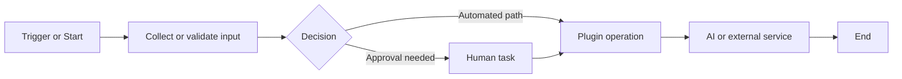
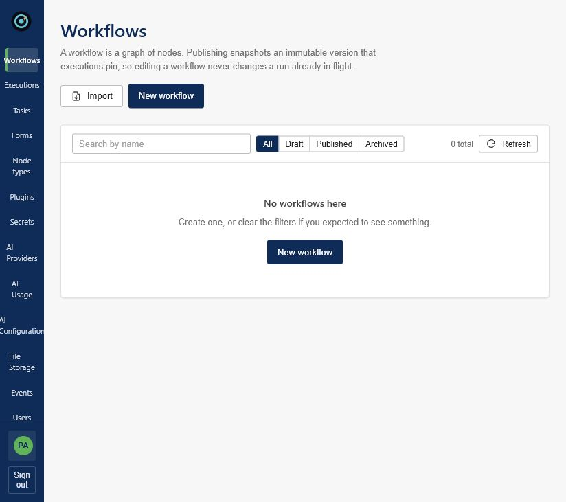
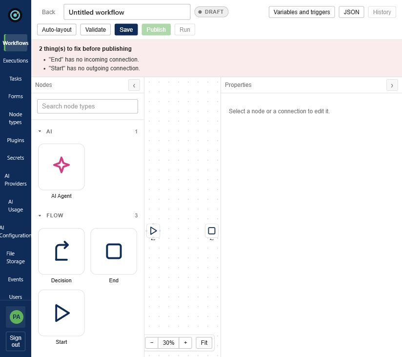
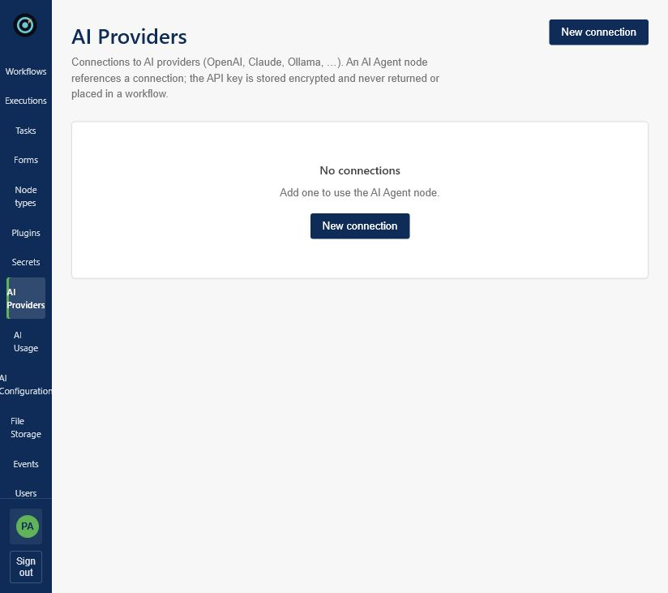
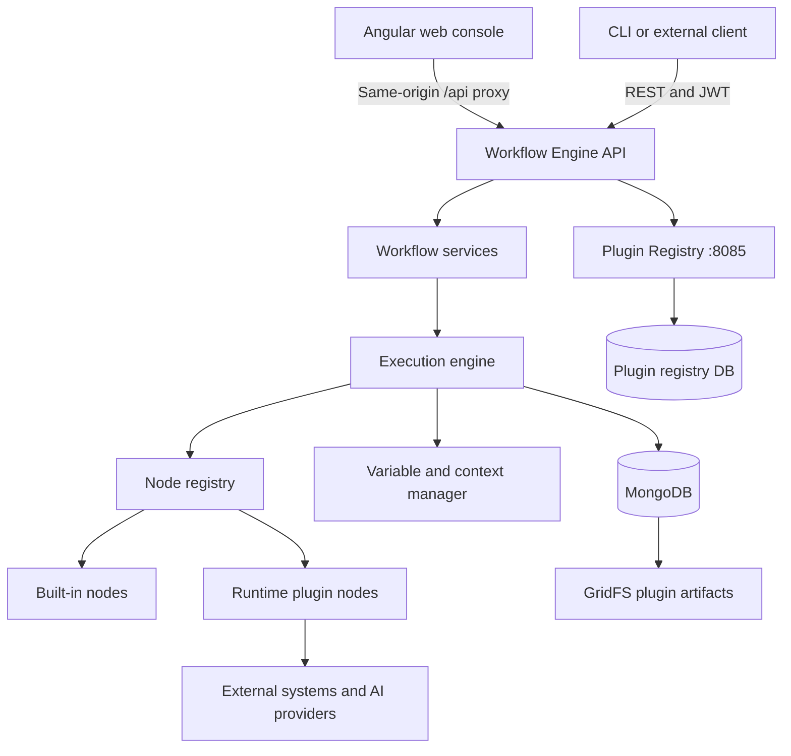
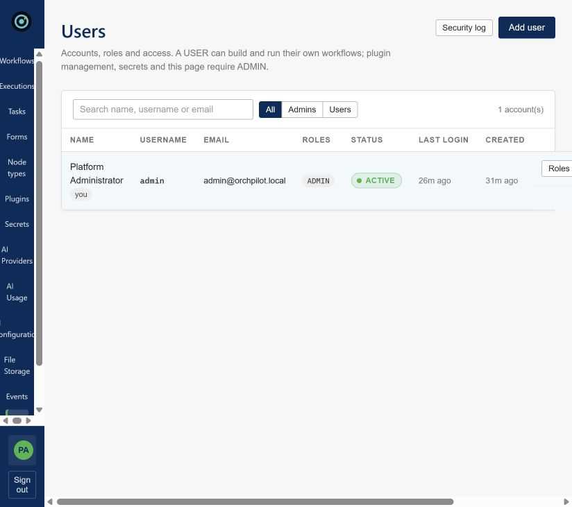
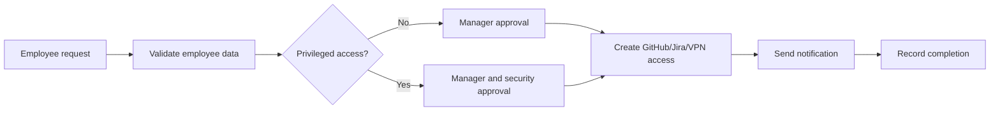

# OrchPilot: End-to-End Product and Technical Guide

> A governed workflow orchestration platform for long-running processes that span people, software systems, infrastructure, and AI.

**Document status:** Product and technical overview based on the current `workflow-engine` codebase  
**Repository:** `Workflow-OrchPilot/workflow-engine`  
**Version reviewed:** Local repository state on 26 August 2026

---

## 1. Executive summary

OrchPilot is an extensible workflow execution platform. It lets teams visually define, publish, run, monitor, and audit business and technical processes as graphs of connected nodes.

Its strongest market position is not “another Zapier.” OrchPilot is better described as a **governed orchestration control plane** for workflows that must remain reliable and accountable over minutes, days, or weeks. Those workflows can include automated API calls, infrastructure operations, approval forms, scheduled jobs, business decisions, and AI agents.

The platform’s central technical differentiator is its runtime plugin architecture. The core engine understands workflow mechanics but does not hard-code individual integrations. New node types can be uploaded as validated Java plugin archives, stored in MongoDB GridFS, loaded in isolated class loaders, activated without rebuilding the engine, and exposed dynamically to the visual designer.

The current product already provides substantial foundations:

- Visual workflow and form design
- Immutable published workflow versions
- Synchronous, asynchronous, scheduled, event-driven, and manual execution
- Human tasks with assignment, claiming, drafts, deadlines, expiry, and history
- Persistent execution state and restart recovery
- Retry, idempotency, and compensation controls
- Runtime plugins and a separate plugin registry
- User, role, permission, JWT, secret, and audit controls
- AI provider and AI-agent-node support
- Import/export through the portable `.orchpilot` format
- Operational UIs for workflows, executions, tasks, plugins, users, and settings

---

## 2. The problem OrchPilot addresses

Important organizational processes rarely live inside one application. A single process might:

1. Receive a request from an API or schedule.
2. Validate data and make a rules-based decision.
3. Ask a person to approve or correct information.
4. Call several internal and external systems.
5. Provision infrastructure or modify a service.
6. Ask an AI model to classify or summarize content.
7. Wait hours or days for another event.
8. Recover safely if a service or server fails.
9. Preserve an audit trail explaining every decision.

Organizations often connect these steps with scripts, email, tickets, cron jobs, and application-specific integrations. The result is fragmented ownership, weak observability, duplicate actions during retries, manual follow-up, and an incomplete audit trail.

OrchPilot provides one place to model and operate the complete process while preserving human accountability and technical reliability.

---

## 3. Product vision

**Vision:** Make every important cross-system process visible, durable, governed, and easy to extend.

**Product promise:** A team should be able to turn a documented operating procedure into an executable workflow without rebuilding the orchestration engine for every new integration.

**Recommended positioning:**

> OrchPilot coordinates long-running, approval-heavy operations across people, systems, infrastructure, and AI—with versioning, recovery, security, and auditability built in.

### What OrchPilot is

- A workflow orchestration and execution engine
- A visual workflow and form design environment
- A human-task and approval system
- A runtime plugin platform
- An execution observability and governance layer
- A foundation for AI-assisted operational workflows

### What OrchPilot is not

- A simple consumer automation tool
- Only a BPM diagram editor
- Only a developer SDK for code-defined workflows
- A replacement for every underlying business application
- A general-purpose AI model or AI assistant by itself

---

## 4. Who the product is for

The recommended initial customers are mid-market and enterprise organizations, especially those with 500–5,000 employees and processes that cross several systems.

### Primary users

| User | Need | OrchPilot value |
|---|---|---|
| Platform engineer | Reliable automation and extensibility | Durable execution, plugins, APIs, operational visibility |
| IT operations team | Standardized service workflows | Forms, approvals, infrastructure plugins, audit history |
| Business operations team | Visibility into multi-step processes | Visual workflows, task inbox, status and ownership |
| Security/compliance team | Controlled access and evidence | RBAC, encrypted secrets, immutable versions, audit logs |
| Application developer | Integrate a proprietary system | Plugin SDK and runtime node registration |
| Approver or operator | Complete assigned human work | Task inbox, forms, drafts, reassignment, task history |
| Administrator | Govern the platform | Users, roles, settings, plugins, providers, and execution controls |

### Strong initial use cases

- Employee onboarding and access provisioning
- Vendor or expense approval
- IT service fulfillment
- Security exception review
- Incident response and escalation
- Infrastructure provisioning with approval gates
- Customer onboarding and verification
- Data correction or exception handling
- AI-assisted document triage with human validation
- Release, deployment, and change-management workflows

---

## 5. How the product works

A workflow is a directed graph. Nodes perform work; edges determine which node executes next.



### Typical lifecycle

1. A designer creates a draft workflow.
2. Nodes are selected from the dynamic node catalogue.
3. Variables, forms, branches, retry rules, and error policies are configured.
4. The server validates the graph.
5. Publishing creates an immutable version.
6. A manual call, event, API request, or schedule creates an execution.
7. The engine advances node by node and persists state at node boundaries.
8. A form node creates a human task and parks the execution without holding a thread.
9. Submission resumes the pinned workflow version.
10. Logs, node results, ownership, and audit records remain available for investigation.

### Built-in node types

| Node | Purpose |
|---|---|
| `START` | Entry point; initializes variables from defaults and execution input |
| `FORM` | Creates human work and waits for a validated submission |
| `DECISION` | Evaluates ordered conditions and selects an outgoing branch |
| `END` | Completes the run and assembles the result |

All integration-specific behavior arrives through plugins rather than changes to the engine.

---

## 6. Major product capabilities

### 6.1 Visual workflow design

The Angular console provides a workflow catalogue and graphical designer. Users can configure workflow nodes, connections, forms, execution behavior, and plugin-provided properties.

Because plugins publish configuration schemas, the UI can render the property panel for a newly installed node without a frontend release.





### 6.2 Versioning and safe publishing

Draft workflows can change. Published versions are immutable snapshots. Each execution pins a version, which prevents later edits from changing a workflow already in progress.

This is essential for long-running processes: an approval started on Monday should not silently adopt a different definition published on Thursday.

### 6.3 Execution modes

All modes use the same execution engine:

| Mode | Example |
|---|---|
| Synchronous | An API waits for the workflow result |
| Asynchronous | The API returns an execution ID immediately |
| Scheduled | A cron trigger starts the workflow |
| Event-driven | A named domain event creates a run |
| Manual | An authorized user launches the workflow |

### 6.4 Human tasks and forms

Human tasks are first-class workflow steps rather than external email conventions. Capabilities include:

- Direct assignees and candidate users/groups
- Open task claiming
- Draft saving
- Server-side form validation
- Typed variable mapping
- Due times and reminders
- Enforced expiry
- Reassignment and cancellation
- Complete task history
- Separation between administrative control and the right to approve

Only the assignee can submit a task. An administrator can reassign or cancel it but cannot record another person’s approval without first reassigning the task, which preserves the integrity of the audit record.

### 6.5 Reliability and recovery

Execution state is persisted at node boundaries. If an engine instance crashes, another instance can detect a stale heartbeat, claim the run through a conditional update, and resume it from the last completed node.

Reliability features include:

- Persistent state and checkpoints
- Heartbeats and stale-execution recovery
- Retry policies with backoff
- Retryable versus terminal error distinction
- `FAIL_WORKFLOW`, `SKIP`, `CONTINUE`, and `COMPENSATE` error policies
- Deterministic idempotency keys for plugin operations
- Replay of prior successful output for non-idempotent actions
- Cluster-safe schedule claiming

### 6.6 Variables and expressions

The platform provides input, workflow, node, and system scopes:

```text
${input.employeeId}
${workflow.orderId}
${node.approval.approved}
${system.executionId}
```

Whole-value placeholders preserve data types. Missing values remain visible instead of silently becoming empty strings. Decision expressions use a constrained Spring Expression Language context that rejects constructors, type references, bean access, and assignment.

### 6.7 Plugin system

Plugins extend the platform at runtime. A plugin can declare actions, workflow node types, or triggers through the shared SDK.

Plugin lifecycle:


Important controls include:

- SHA-256 integrity information
- Versioned plugin metadata
- Dedicated class loader per plugin
- Activation, deactivation, reload, and default-version controls
- Allowed network hosts
- Secret namespace scopes
- Execution redaction and auditability
- A separate registry service with its own database

The repository includes plugin modules for SendGrid, SMTP email, MongoDB, VPN, REST APIs, Slack, GitHub, Jira, Excel, Docker Registry, and several Google Cloud operations.

### 6.8 AI orchestration

The codebase includes AI provider configuration, AI-agent workflow nodes, usage-related controls, and CLI configuration support. This enables workflows in which a model classifies, extracts, summarizes, or recommends while the workflow engine controls the surrounding process.

The recommended AI principle is **bounded autonomy**:

- AI proposes or transforms.
- The workflow applies deterministic policy.
- Humans approve sensitive decisions.
- The audit trail records inputs, outputs, model/provider metadata, and final responsibility.



### 6.9 Portability

The `.orchpilot` format supports moving workflow packages between environments. Portability should be used with environment-specific provider and secret references so credentials never need to be embedded in the workflow definition.

---

## 7. Technical architecture



### Main deployable components

| Component | Technology | Responsibility |
|---|---|---|
| Workflow engine | Java 17, Spring Boot 4 | APIs, workflow definitions, execution, tasks, auth, audit, secrets |
| Plugin SDK | Java | Stable contracts for plugin developers |
| Plugin registry | Java, Spring Boot | Plugin catalogue, versions, publication, distribution |
| Workflow console | Angular 20, TypeScript, RxJS | Design and operational user experience |
| MongoDB | MongoDB 7 | Definitions, executions, users, tasks, audit, metadata |
| GridFS | MongoDB GridFS | Plugin binary storage |
| Container stack | Docker Compose, nginx | Local/full-stack deployment and same-origin routing |

### Repository modules

```text
workflow-engine/
├── workflow-engine-core/     Main API and execution engine
├── workflow-plugin-sdk/      Plugin contracts and schema utilities
├── plugin-server/            Separate plugin registry service
├── workflow-engine-ui/       Main Angular console
├── plugin-server-ui/         Plugin registry Angular UI
├── plugins/                  Integration and infrastructure plugins
├── examples/                 Example workflow definitions
├── docker-compose.yml        MongoDB, registry, engine, and console
└── run-local.ps1             Windows local launcher
```

### Codebase scale at review time

- Approximately 650 production Java source files and 80,000 lines
- Approximately 141 Java test files and 21,000 test lines
- 73 core test classes
- 27 REST controllers and roughly 160 mapped REST handlers
- 13 plugin modules
- Approximately 118 Angular source files and 28,000 lines

These figures describe code volume, not production readiness or performance capacity.

---

## 8. Technology choices and rationale

### Java 17 and Spring Boot 4

Java provides mature concurrency, security, HTTP, database, and operational tooling. Spring Boot supplies dependency injection, REST endpoints, validation, security, configuration, scheduling, and MongoDB integration.

### Angular 20 and TypeScript

Angular provides a structured framework for a multi-screen administrative product. RxJS supports asynchronous UI behavior, while TypeScript gives typed contracts for workflows, tasks, and designer state.

### MongoDB 7

Workflow definitions, execution state, nested node results, audit events, forms, and plugin metadata are naturally document-oriented. MongoDB also supplies conditional updates, indexes, transactions/change streams in replica-set mode, and GridFS for plugin binaries.

### Maven

The multi-module Maven reactor keeps the engine, SDK, registry, and plugins aligned. Individual plugin versions can still evolve separately from the SDK version.

### Docker and nginx

Docker Compose supplies a reproducible local stack. nginx serves the Angular application and proxies `/api` to the engine, preserving a same-origin authentication model.

---

## 9. API surface

The platform exposes APIs for:

- Authentication, refresh, logout, registration, and password management
- Users, roles, permissions, and availability lookup
- Workflows, validation, publication, versions, archival, and execution
- Executions, logs, pause, resume, cancel, pending state, and form submission
- Forms, fields, versions, cloning, validation, and publication
- Human tasks, claiming, drafting, completing, releasing, reassigning, and history
- Plugins, versions, upload, activation, deactivation, reload, deletion, and execution records
- Node catalogue and node schemas
- Events and schedules
- Secrets and provider configuration
- AI configuration and usage
- Platform settings and audit information

Swagger/OpenAPI is available locally at:

- `http://localhost:8080/swagger-ui.html`
- If redirected by the installed Springdoc version: `http://localhost:8080/swagger-ui/index.html`

The API root is protected; receiving `401 Authentication is required` at `http://localhost:8080/` means the backend is responding and security is active. It is not the product UI.

---

## 10. Security model

### Authentication

- Argon2id password hashing
- JWT access tokens, 15-minute default lifetime
- Opaque rotating refresh tokens, seven-day default lifetime
- Refresh-token reuse detection and family revocation
- Generic login failures to reduce user enumeration
- Dummy password verification for unknown users
- Username- and IP-based throttling
- Stateless Spring Security request processing

### Authorization

- Roles bundle granular permissions
- Endpoints authorize permissions rather than hard-coded role names
- Workflow ownership rules are enforced in the service layer
- Plugins receive a limited user projection rather than credentials or tokens

### Secret handling

- User passwords are one-way Argon2id hashes
- Integration credentials use reversible AES-256-GCM encryption
- Plugin access can be restricted by secret prefix
- Plugin network access can be restricted to allowed hosts
- Workflow definitions reference secrets rather than contain them

### Audit

Security audit records cover login, logout, refresh, password changes, user and role changes, lockouts, token-reuse detection, and access denial. Credentials, hashes, JWTs, refresh tokens, and secret values are excluded.



### Production security requirements

Before internet-accessible deployment:

1. Replace all committed development keys and passwords.
2. Enable the production Spring profile.
3. Terminate TLS and set secure-cookie behavior correctly.
4. Store signing and encryption keys in a managed secret system.
5. Disable self-registration if accounts are centrally provisioned.
6. Restrict browser origins and direct engine exposure.
7. Prefer RS256 when multiple services validate tokens.
8. Define key rotation, backup, incident-response, and access-review procedures.

---

## 11. Running OrchPilot locally

### Option A: Docker Compose

Prerequisites:

- Docker Desktop with Compose
- Ports `27017`, `8080`, `8085`, and `4200` available

From the repository root:

```powershell
docker compose up --build
```

Services:

| Service | URL/port |
|---|---|
| Main console | `http://localhost:4200` |
| Workflow API | `http://localhost:8080` |
| Swagger UI | `http://localhost:8080/swagger-ui/index.html` |
| Plugin registry | `http://localhost:8085` |
| MongoDB | `localhost:27017` |

Follow logs:

```powershell
docker compose logs -f workflow-engine workflow-ui plugin-registry
```

Stop the stack:

```powershell
docker compose down
```

To stop without deleting data, do not add `--volumes`. Removing the MongoDB volume deletes local database data.

### Option B: Local Java backend

Prerequisites:

- JDK 17 or later
- Maven 3.9 or later
- MongoDB on `localhost:27017`

Build all Java modules and sample plugins:

```powershell
mvn clean install
```

Use the Windows launcher:

```powershell
.\run-local.ps1
```

The launcher locates the built engine JAR, configures local values, and can bootstrap the first administrator when required.

Manual alternative:

```powershell
$env:MONGODB_URI = "mongodb://localhost:27017/workflow_engine"
$env:WORKFLOW_ADMIN_API_KEY = "replace-this-local-value"
$env:WORKFLOW_SECRETS_KEY = "replace-with-a-valid-32-byte-key"
java -jar workflow-engine-core\target\workflow-engine.jar
```

### Running the Angular console separately

```powershell
cd workflow-engine-ui
npm install
npm start
```

The development server runs at `http://localhost:4200` and proxies `/api` to port `8080`.

### Initial administrator

On a fresh database, the default development configuration can create:

```text
Username: admin
Email:    admin@orchpilot.local
Password: Platform-Dev-Adm1n!
```

This credential is for local development only. Change it immediately and never use the committed default in a shared or production environment. The bootstrap process creates the administrator only when the relevant bootstrap conditions are met; it does not overwrite an existing account on every startup.

---

## 12. Operating and troubleshooting the stack

### Check whether ports are listening

```powershell
Get-NetTCPConnection -State Listen |
  Where-Object LocalPort -in 4200,8080,8085,27017 |
  Select-Object LocalAddress,LocalPort,OwningProcess
```

### Check containers

```powershell
docker compose ps
docker compose logs --tail 200 workflow-engine
```

### Common symptoms

| Symptom | Meaning or likely cause |
|---|---|
| `401` JSON at port 8080 | Backend is reachable; the requested endpoint requires authentication |
| Blank Swagger UI with CSP errors | A security header is blocking Swagger scripts/images; inspect the response CSP configuration |
| `ERR_CONNECTION_REFUSED` on 4200 | UI process/container is not running or port is not published |
| Login fails on a fresh DB | Inspect bootstrap-admin logs and active configuration; confirm the account was created |
| Login fails on an old DB | The bootstrap account may already exist with a changed password |
| Plugin node is missing | Check plugin publication, sync, activation, compatible SDK version, and engine logs |
| Workflow stays waiting | Inspect its pending signal and corresponding human task |
| MongoDB starts but transactions fail | Ensure it is running as a replica set, as configured by Compose |

### Health verification

Use actuator health endpoints where enabled and verify the complete user journey:

1. Console loads.
2. Login succeeds.
3. Workflow list loads.
4. A draft can be created and validated.
5. Publishing creates a version.
6. Execution starts.
7. A human task can be claimed and completed.
8. Execution reaches completion.
9. Logs and history show the expected sequence.

---

## 13. Example end-to-end scenario

### Employee access request



The workflow can:

- Accept a request through a form or API
- Use decision rules to determine approval requirements
- Assign a task to the correct manager or security group
- Preserve drafts and task history
- Call GitHub, Jira, VPN, or REST plugins after approval
- Retry transient failures without repeating successful non-idempotent actions
- Compensate by removing previously granted access if a later step fails
- Notify the requester
- Retain the exact published workflow version and execution evidence

This scenario demonstrates the combination that differentiates OrchPilot: human accountability, integration extensibility, durable execution, and governance in one process.

---

## 14. Competitive landscape

OrchPilot sits between several established categories:

| Category | Examples | Typical strength | OrchPilot opportunity |
|---|---|---|---|
| General automation | Zapier, Make, n8n | Many connectors and quick automation | Win where approval, governance, durability, and private plugins matter |
| BPM/orchestration suites | Camunda | Mature enterprise process management | Offer a simpler plugin-native product and clearer operations experience |
| Code-first durable execution | Temporal | Strong developer-controlled reliability | Provide visual design, human work, and business visibility by default |
| RPA | UiPath and peers | Automating legacy user interfaces | Prefer API/plugin automation with RPA as a possible integration |
| AI agent frameworks | Various | Fast experimentation with autonomous agents | Govern agents inside deterministic, auditable workflows |

The product should avoid competing primarily on connector count. Large incumbents already have that advantage. The defensible wedge is **governed, extensible orchestration for private and sensitive operations**.

---

## 15. Business model hypothesis

The following is a recommendation, not current revenue data.

### Suggested packaging

1. **Annual platform subscription** based on deployment/environment and core governance features.
2. **Execution bands** for volume and capacity expansion.
3. **Enterprise add-ons** for SSO/SCIM, advanced audit export, private networking, HA support, and policy controls.
4. **Certified/private plugin program** for partners and customer-specific integrations.
5. **Fixed launch services** for the first production workflow, integration, training, and operating model.

### Land-and-expand motion

- Land with one high-friction, measurable workflow.
- Prove cycle-time, failure-rate, and audit improvements.
- Expand to adjacent processes using the same governance and plugin foundation.
- Add departments, executions, environments, and certified plugins.

### Metrics that matter

- Time to deploy the first production workflow
- Workflow completion time before and after OrchPilot
- Manual handoffs eliminated
- Automation success and recovery rate
- Approval SLA compliance
- Number of production workflows per customer
- Active workflow designers and task participants
- Plugin reuse across workflows
- Expansion revenue and customer retention

---

## 16. Product roadmap recommendation

### Phase 1: Prove the wedge (0–3 months)

- Recruit five design partners in regulated operations, IT service delivery, or platform engineering
- Select one repeatable approval-heavy process
- Instrument time-to-value and execution outcomes
- Improve onboarding, templates, demo data, and installation diagnostics
- Publish a clear deployment and security guide

### Phase 2: Enterprise readiness (4–9 months)

- SSO through OIDC/SAML and SCIM provisioning
- External secret-manager integration
- Backup, restore, migration, and compatibility tooling
- HA, load, recovery, and chaos testing with published SLOs
- Tenant-isolation decision and enforcement if offering SaaS
- Policy controls and richer audit export
- Three paid production pilots

### Phase 3: Ecosystem and expansion (10–18 months)

- Signed and certified plugin distribution
- Stronger sandboxing or out-of-process execution for untrusted plugins
- Partner SDK experience, samples, compatibility tests, and certification
- Curated workflow-template library
- Second-department expansion playbook
- AI evaluation, model-cost governance, and approval policies

---

## 17. Technical priorities and known gaps

The codebase demonstrates broad capability, but investors and enterprise buyers will ask for operating evidence. Priority areas are:

### Performance and resilience evidence

- Define latency and throughput targets
- Benchmark concurrent executions and waiting tasks
- Test recovery during process and infrastructure failure
- Publish recovery point and recovery time objectives
- Verify schedule and execution claiming under multi-instance load

### Enterprise identity and deployment

- Add SSO and SCIM
- Integrate managed secrets and key rotation
- Document Kubernetes or equivalent production deployment
- Automate database indexes and compatible schema/data migrations
- Define backup and restore drills

### Plugin trust boundary

Class-loader isolation is valuable for dependency separation, but it is not a complete security sandbox for hostile code. A marketplace should add:

- Artifact signing and publisher identity
- Static and dependency scanning
- Compatibility certification
- Resource quotas and execution time limits
- Stronger process/container isolation for untrusted plugins
- Network egress enforcement below the application layer

### Product focus

The repository is broad. The commercial product should focus on a small number of repeatable workflows before expanding every feature surface. Product-market fit is stronger evidence than module count.

---

## 18. Market-impact opportunity

OrchPilot can have meaningful market impact by making reliable orchestration accessible to both technical and operational teams.

### Potential impact

- Replace hidden scripts and inbox-driven approvals with visible processes
- Reduce repeated work and human follow-up
- Make AI adoption safer by surrounding models with deterministic controls
- Help regulated organizations produce stronger execution evidence
- Let customers integrate private systems without waiting for the platform vendor
- Preserve organizational knowledge as executable, versioned workflows
- Shorten the path from an operating procedure to measurable automation

### The key narrative

Companies do not merely need more automation. They need automation they can **trust, explain, recover, and govern**. OrchPilot’s opportunity is to become the layer where that responsibility is enforced.

---

## 19. Recommended product principles

1. **Durability before novelty.** A workflow must survive failure before it gains advanced features.
2. **Humans remain accountable.** Sensitive approvals must preserve who actually decided.
3. **Published behavior is immutable.** Running work should never change underneath an operator.
4. **Integrations are extensions, not engine branches.** Keep the core independent of vendors.
5. **Secrets never belong in workflow definitions.** Reference them through scoped storage.
6. **AI operates inside policy.** Models should be bounded by workflow rules, permissions, and review.
7. **Observability is part of the product.** Every state change should be understandable.
8. **Private systems are a first-class use case.** Extensibility should serve the customer’s unique environment.
9. **Start with one painful process.** Earn expansion through measurable outcomes.

---

## 20. Suggested investor pitch

> Every company has critical processes that cross people, APIs, infrastructure, and now AI. Today those processes are fragmented across tickets, scripts, inboxes, and point automation tools. When something fails, teams cannot reliably tell what happened, what already completed, or who approved it.
>
> OrchPilot is a governed orchestration control plane for these long-running operations. Teams visually model a process, add human approval where accountability matters, connect private or external systems through runtime plugins, and let a durable engine execute and recover the work. Every run is pinned to an immutable version and produces an operational and security trail.
>
> We are not trying to win by copying thousands of commodity connectors. We are building the trusted orchestration layer for high-value workflows that generic automation tools underserve and code-only engines make difficult for operations teams to own.

---

## 21. Due-diligence checklist

Before using this document externally, add verified company-specific information:

- Founder and team background
- Customer interviews and design partners
- Current active users and workflows
- Paid pilots, revenue, or letters of intent
- Customer outcome measurements
- Pricing and contract structure
- Open-source/commercial license strategy
- Deployment model: self-hosted, managed, or hybrid
- Security review and compliance plan
- Tested execution scale and reliability results
- Fundraising amount, use of funds, and milestone runway

No traction or financial claims should be presented without supporting evidence.

---

## 22. Further repository documentation

Detailed technical references are available in the repository:

- `README.md` — product behavior and quick start
- `ARCHITECTURE.md` — modules, collections, plugin lifecycle, and execution flow
- `SECURITY.md` — authentication, authorization, secrets, tokens, and auditing
- `PLUGIN_DEVELOPMENT.md` — creating and packaging plugins
- `PLUGIN_OPERATION_FRAMEWORK.md` — plugin execution behavior
- `WORKFLOW_INSTANCE_LIFECYCLE.md` — execution states and transitions
- `WORKFLOW_PORTABILITY.md` — `.orchpilot` import and export
- `WORKFLOW_EXTERNAL_FORMS.md` — externally served form flows
- `WORKFLOW_FILE_STORAGE.md` — workflow file handling
- `AI_AGENT_NODE.md` — AI agent node behavior
- `AI_CLI_CONFIGURATION.md` — AI configuration through the CLI
- `examples/` — sample employee approval, order fulfillment, and support triage workflows

---

## 23. External market references

- Gartner, Business Orchestration and Automation Technologies forecast: <https://www.gartner.com/en/documents/6530402>
- Gartner, hyperautomation software forecast: <https://www.gartner.com/en/documents/6165623>
- Gartner, enterprise network automation outlook: <https://www.gartner.com/en/newsroom/press-releases/2024-09-18-gartner-says-30-percent-of-enterprises-will-automate-more-than-half-of-their-network-activities-by-2026>
- Camunda platform: <https://camunda.com/platform/>
- Temporal platform: <https://temporal.io/>
- n8n pricing and packaging: <https://n8n.io/pricing/>

---

## 24. Final assessment

OrchPilot has a credible technical foundation for a governed orchestration product. Its most compelling elements are the combination of persistent long-running execution, first-class human tasks, runtime plugins, immutable workflow versions, scoped secrets, auditability, and AI-provider support.

The next step is not simply adding more features. It is proving that this foundation solves one expensive operational problem better than existing alternatives, then converting that proof into repeatable deployment, measurable outcomes, and an ecosystem of trusted extensions.

If OrchPilot maintains that focus, it can become the operational control layer through which organizations safely coordinate people, software, infrastructure, and AI.
